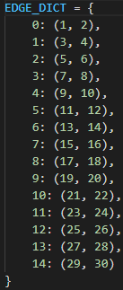
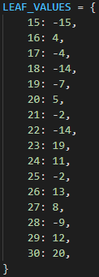
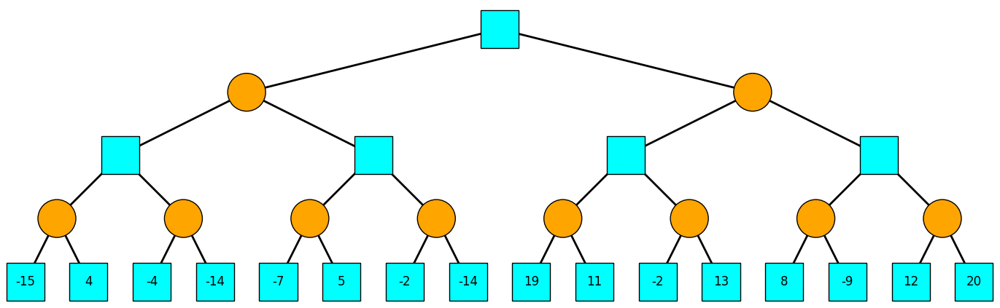
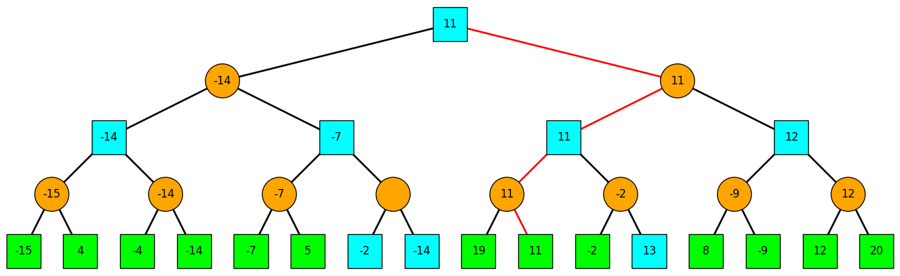
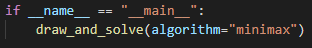

# Alpha-Beta Search Visualisation

A tool to help visualise alpha-beta search in a small 2-player game. It is assumed that:

- the player to start is a maximizing player
- the players alternate turns

To create a game tree:

- label its vertices from 0 to n and create a dictionary named EDGE_DICT in the "tree_data.py" file in which each key is a vertex v with corresponding entry an iterable containing the children of v, as shown below:

- create a dictionary named LEAF_VALUES in the "tree_data.py" file indicating the leaf nodes and their corresponding values, as shown below:

For example, the above tree data create the following game tree, which appears in a new window:

As per convention, the cyan squares indicate a max player and the orange circles indicate a min player.

Once the user closes the window with the generated tree, a new window containing a visualisation of the alpha-beta search algorithm on the tree appears.

The value returned for all vertices except those not searched by the algorithm is shown. Leaf nodes that were searched by the algorithm are indicated by green. An optimal path for the game is indicated by red.

To generate and solve a game tree, edit the "tree_data.py" file as explained above and run the "solve.py" file. To change which formulation of alpha-beta is visualised (minimax or negamax) edit the following line in "solve.py":

